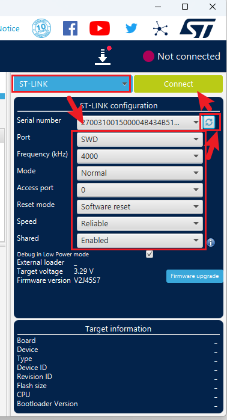

> 注意：存放 DshanMCU-DshanMCU_H7R 文件夹的路径不能有中文！

# 准备

## 硬件

1.	DshanMCU-H7R核心板 * 1
2.	DshanMCU-H7R底板* 1
3.	480*480方屏及底板、FPC排线* 1
4.	ST-Link及接线* 1
5.	USB Type-C数据线* 1

> 烧录时，USB Type-C数据线和ST-Link都需要接到DshanMCU-H7R核心板上！

## 软件

1.	安装STM32CubeProgrammer（按照默认选项安装，不要变动）
2.	将 `DshanMCU_H7R/test` 目录中的 DshanMCU_H7R_Custom_ExtMemLoader_ExtMemLoader_SPI_0x00000000.stldr 复制到如下目录（默认是 `C:\Program Files\STMicroelectronics\STM32Cube\STM32CubeProgrammer\bin\ExternalLoader` ）：

3.	打开 STM32CubeProgrammer按照如下操作，勾选对应选项：

## 接线准备

1.	将核心板的拨码开关拨到ON处（后面一直保持这样，不需要拨回去）：

2.	接好屏幕排线，将其对接到核心板（注意fpc座子的数字一一对应，谨防接反！）
3.	将ST-Link和USB Type-C数据线连接电脑和核心板。

# 开始烧写

## 烧写Boot固件

打开 STM32CubeProgrammer ，按照如下操作连接开发板：

按照如下操作选择boot固件 `DshanMCU_H7R/test/DshanMCU_H7R_Custom_Boot_Boot.elf` 进行烧写：

按照如下配置，点击烧录：

烧录成功提示：

## 烧写App固件

与上面烧写Boot固件的操作一样选择要烧写的App固件 `DshanMCU_H7R/test/DshanMCU_H7R_LVGL_Desktop_Appli.elf`，但是在烧写前，按照下图进行配置、最后点击烧写：

**烧录时间会比较久，需要耐心等待几分钟**

烧录完成之后，将USB Type-C和st-link拔除，然后重新接上 USB Type-C 线，**耐心等待几秒钟** 启动。
